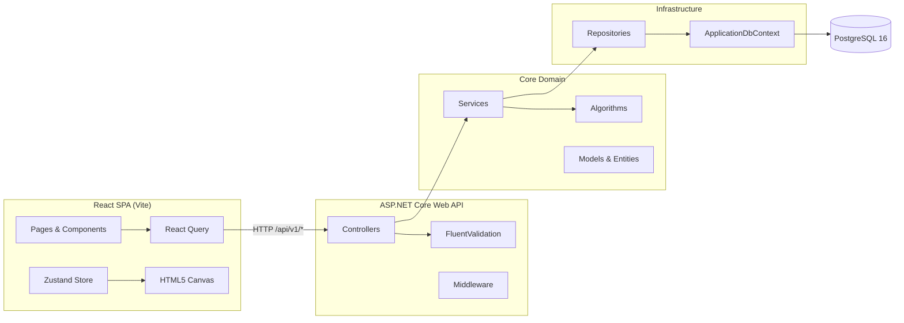
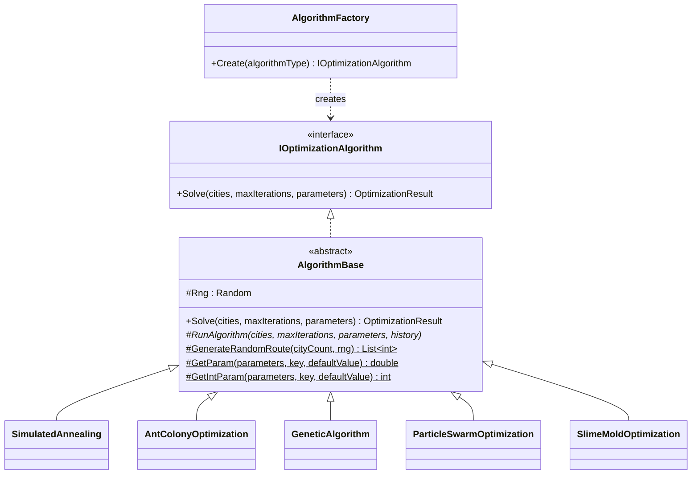
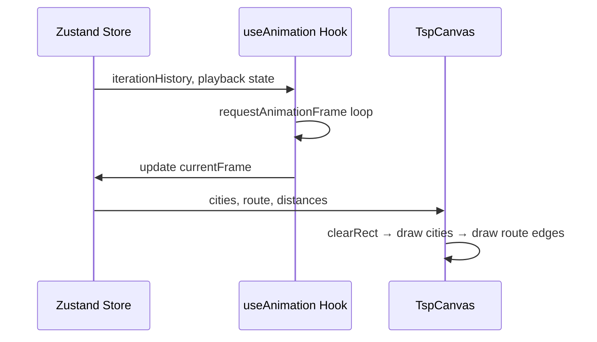
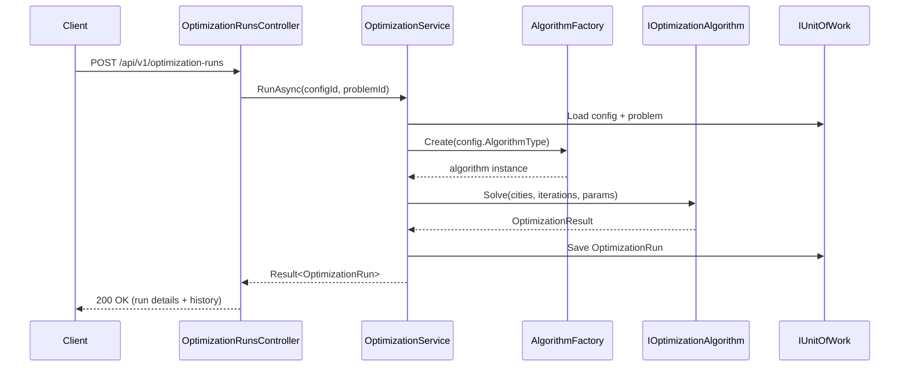
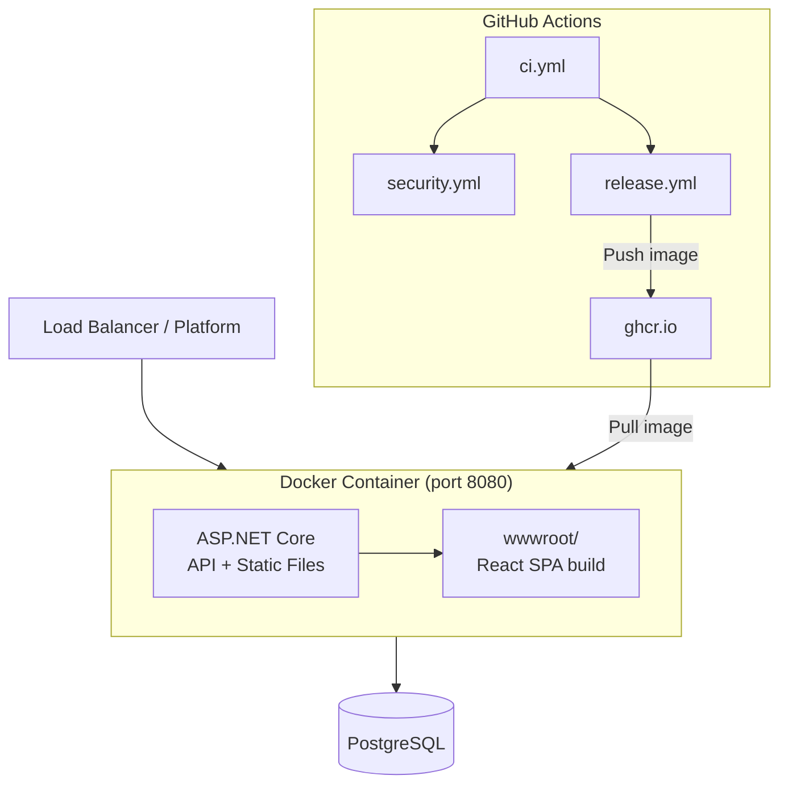

# Architecture

## System Overview



## Backend Architecture

### Three-Layer Design

| Layer | Project | Responsibility |
|-------|---------|----------------|
| **API** | `OptimizationHeuristics.Api` | Controllers, DTOs, validators, middleware, HTTP concerns |
| **Core** | `OptimizationHeuristics.Core` | Domain models, algorithm implementations, service interfaces & implementations |
| **Infrastructure** | `OptimizationHeuristics.Infrastructure` | EF Core DbContext, repository implementations, data access |

Dependencies flow inward: API → Core ← Infrastructure. Core has no dependency on Infrastructure or API.

### Algorithm Design (Strategy + Factory)



Each algorithm overrides `RunAlgorithm()` with its specific heuristic. `AlgorithmFactory` creates instances by `AlgorithmType` enum value.

### Services & Error Handling

Services use **FluentResults** (`Result<T>`) for error handling instead of exceptions. Controllers are thin — they call a service method and convert the `Result` to an `ActionResult` via `ResultExtensions.ToActionResult()`.

| Service | Responsibility |
|---------|----------------|
| `ProblemDefinitionService` | CRUD for TSP problem definitions (city sets) |
| `AlgorithmConfigurationService` | CRUD for algorithm configurations (type + parameters) |
| `OptimizationService` | Runs an algorithm against a problem, stores results |

### Repository Pattern

`IUnitOfWork` aggregates repository access and wraps `SaveChangesAsync`. Repositories are scoped per-request via DI.

## Frontend Architecture

### State Management

| Concern | Technology | Purpose |
|---------|------------|---------|
| **Server state** | React Query (TanStack) | API data fetching, caching (30s stale time), mutations |
| **Animation state** | Zustand | Current run, iteration index, playback state, frame data |

### Pages & Routing

React Router v6 with three routes:

| Route | Page | Description |
|-------|------|-------------|
| `/` | `HomePage` | Main solver interface — configure, run, visualize |
| `/history` | `HistoryPage` | Browse and replay past optimization runs |
| `/configurations` | `ConfigurationsPage` | Manage algorithm configurations (CRUD) |

### Canvas Rendering Pipeline



The `useAnimation` hook drives playback via `requestAnimationFrame`, stepping through iteration history frames. `TspCanvas` renders city nodes and route edges on an HTML5 Canvas element.

### Key Components

| Component | Purpose |
|-----------|---------|
| `TspCanvas` | HTML5 Canvas rendering of cities and routes |
| `CanvasControls` | Play/pause/step animation controls |
| `ConvergenceChart` | Recharts line chart of distance over iterations |
| `ConfigurationPanel` | Algorithm selection and parameter configuration |
| `AlgorithmSelector` | Algorithm type dropdown |
| `ParameterForm` | Dynamic parameter input fields per algorithm |

## API Design

All endpoints are under `/api/v1`. The Vite dev server proxies `/api` and `/health` to `http://localhost:5000`.

### Endpoints

#### Problem Definitions (`/api/v1/problem-definitions`)

| Method | Path | Description |
|--------|------|-------------|
| GET | `/` | List all problem definitions |
| GET | `/{id}` | Get a problem definition by ID |
| POST | `/` | Create a new problem definition |
| PUT | `/{id}` | Update a problem definition |
| DELETE | `/{id}` | Delete a problem definition |

#### Algorithm Configurations (`/api/v1/algorithm-configurations`)

| Method | Path | Description |
|--------|------|-------------|
| GET | `/` | List all configurations |
| GET | `/{id}` | Get a configuration by ID |
| POST | `/` | Create a new configuration |
| PUT | `/{id}` | Update a configuration |
| DELETE | `/{id}` | Delete a configuration |

#### Optimization Runs (`/api/v1/optimization-runs`)

| Method | Path | Description |
|--------|------|-------------|
| POST | `/` | Run an algorithm (accepts `algorithmConfigurationId` + `problemDefinitionId`) |
| GET | `/` | List runs (paginated: `?page=1&pageSize=20`) |
| GET | `/{id}` | Get a run by ID (includes iteration history) |

#### Health Check

| Method | Path | Description |
|--------|------|-------------|
| GET | `/health` | Returns `{ status, timestamp }` |

### Data Flow: Running an Optimization



## Database Schema

```mermaid
erDiagram
    problem_definitions {
        uuid Id PK
        string Name
        string Description
        jsonb Cities "List~City~ (x, y coordinates)"
        timestamp CreatedAt
        timestamp UpdatedAt
    }

    algorithm_configurations {
        uuid Id PK
        string Name
        string Description
        string AlgorithmType "enum: SA, ACO, GA, PSO, SlimeMold"
        int MaxIterations
        jsonb Parameters "Dictionary~string,object~"
        timestamp CreatedAt
        timestamp UpdatedAt
    }

    optimization_runs {
        uuid Id PK
        uuid AlgorithmConfigurationId FK
        uuid ProblemDefinitionId FK
        string Status "Pending, Running, Completed, Failed"
        double BestDistance
        jsonb BestRoute "List~int~ (city indices)"
        jsonb IterationHistory "List~IterationResult~"
        int TotalIterations
        long ExecutionTimeMs
        timestamp CreatedAt
        timestamp UpdatedAt
    }

    problem_definitions ||--o{ optimization_runs : "has many"
    algorithm_configurations ||--o{ optimization_runs : "has many"
```

All three tables use JSONB columns for complex nested data. EF Core value converters handle JSON serialization with `System.Text.Json`. Foreign keys use `DeleteBehavior.Restrict` to prevent cascading deletes.

## Testing Strategy

| Test Project | Scope | Key Patterns |
|-------------|-------|--------------|
| `Core.Tests` | Unit tests for algorithms and services | Small populations (5–10), low iterations (20–30) for speed |
| `Api.Tests` | Controller and validator tests | NSubstitute mocks for services |
| `Infrastructure.Tests` | Repository and DbContext tests | EF Core InMemory provider |
| `Integration.Tests` | End-to-end API tests | `WebApplicationFactory` with InMemory database |

Tools: xUnit, FluentAssertions, NSubstitute, Coverlet (code coverage).

## Deployment Architecture



The application is packaged as a single Docker image containing both the .NET API and the React SPA build (served as static files from `wwwroot/`). The image is built via multi-stage Dockerfile and published to GitHub Container Registry on version tags. See `docker-compose.prod.yml` for a ready-to-run local deployment with PostgreSQL.
